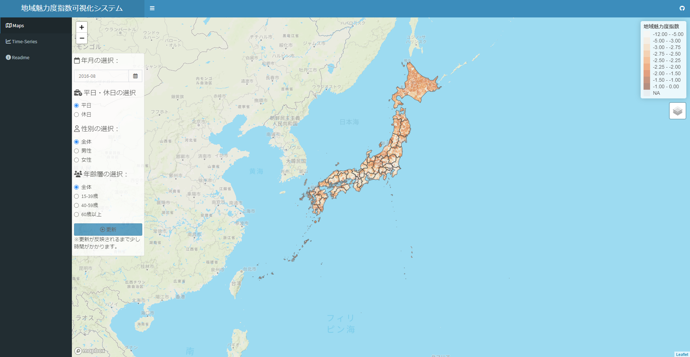

# 地域魅力度指数可視化システム

## Shiny Web App

### 地域魅力度指数

Kondo (2023)において提案した人流データから推定する地域魅力度指数を可視化しています。  
URL: https://keisuke-kondo.shinyapps.io/regional-attractiveness-japan/

### 参考文献
Kondo, K. (2023) "Measuring the Attractiveness of Trip Destinations: A Study of the Kansai Region," RIEB Discussion Paper Series No.2023-07  
URL: https://www.rieb.kobe-u.ac.jp/academic/ra/dp/English/dp2023-07.html

## 利用規約
当サイトで公開している情報（以下「コンテンツ」）は、どなたでも自由に利用できます。コンテンツ利用に当たっては、本利用規約に同意したものとみなします。本利用規約の内容は、必要に応じて事前の予告なしに変更されることがありますので、必ず最新の利用規約の内容をご確認ください。

### 著作権
本コンテンツの著作権は、近藤恵介に帰属します。

### 第三者の権利
本コンテンツは、「From-To分析（滞在人口）」（RESAS）および「統計地理情報システム」（e-Stat）の情報に基づいて作成しています。「From-To分析（滞在人口）」は「モバイル空間統計®」（NTTドコモ）に基づいたデータであり、RESAS APIを利用して2015年9月から2016年8月までの期間をダウンロードして使用しています。本コンテンツを利用する際は、第三者の権利を侵害しないようにしてください。

### 免責事項
<ul>
<li>作成にあたり細心の注意を払っていますが、本サイトの内容の完全性・正確性・有用性等についていかなる保証を行うものでありません。</li>
<li>本サイトを利用したことによるすべての障害・損害・不具合等、作成者および作成者の所属するいかなる団体・組織とも、一切の責任を負いません。</li>
<li>本サイトは、事前の予告なく変更、移転、削除等が行われることがあります。</li>
</ul>

## 使用データ出所

### From-To分析（滞在人口）： RESAS API
URL: https://opendata.resas-portal.go.jp/docs/api/v1/partner/docomo/destination.html

### 都道府県・市区町村シェープファイル：統計地理情報システム（e-Stat）
URL: https://www.e-stat.go.jp/

## 作成者
近藤恵介  
独立行政法人経済産業研究所・上席研究員  
神戸大学経済経営研究所・准教授  
URL: https://keisukekondokk.github.io/  

## 更新履歴

2024年2月1日：「解説」を加筆修正  
2024年1月26日：「利用規約」に「その他」を追加、「競争的資金」を追加  
2024年1月2日：対象地域を全国に拡張し日本語版へ移行  
2023年11月10日：GitHubに関西圏限定版を英語公開  
